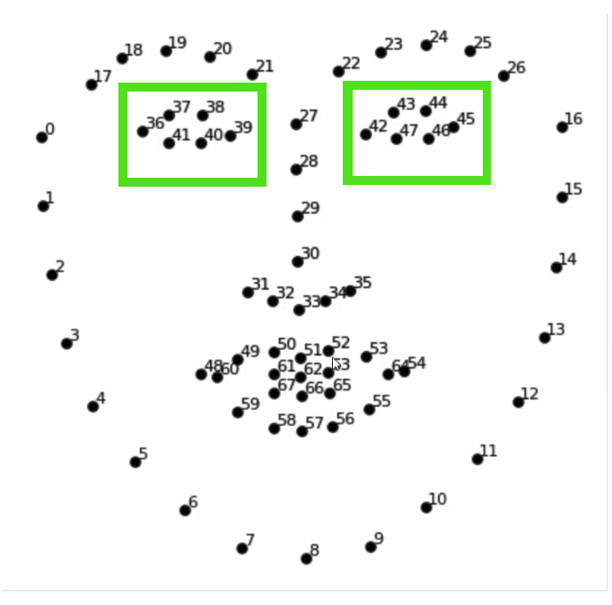

[](https://forthebadge.com)<br>
[](https://forthebadge.com)<br>
[](https://forthebadge.com)


# Realtime GAZE & BLINK Detection. 
In this project, we use Neural Networks for the detection of Eyeblink and Eyegaze concurrently. For that, we use 2 pre-trained Neural Networks. One network is used for the detection of eye-blink and another is used for the detection of 'Left', 'Right', and 'Center' gaze of the eye. For the detection of the eye, we use dlib library. 

### A quick demo can be found [HERE](https://youtu.be/YG0AjafnwXs)

# How it works
For each frame in a second:
1. Using Dlib frontal face detector all of the 68 facial landmarks co-ordinates are detected and the co-ordinates are converted into numpy array.
2. Pass 36,37,38,39,40,41th index of array to the ```crop_eye()```
function as it contains co-ordinates of respective landmarks and function returns cropped image for left eye.
3. Similarly pass 42,43,44,45,46,47 index to get cropped image of right eye.
<br>

4. Pass the cropped eye images through the model for the detection of the eye's state. <br>
5. If the opening of the left eye and opening of the right eye is less than 10% then it is registered as blink and gaze is determined through the index of highest value in the array returned by the model.<br>

6. Show all the status and results in the final window.


# Dependencies
This code was developed on: 
```
python == 3.7.0
opencv-python == 4.3.0.36
tensorflow==2.3.0
dlib == 19.20.0
imutils==0.5.3
```
I was able to achieve more the 20 fps on GTX 1050 and more than 15 fps on i5-7300HQ.


